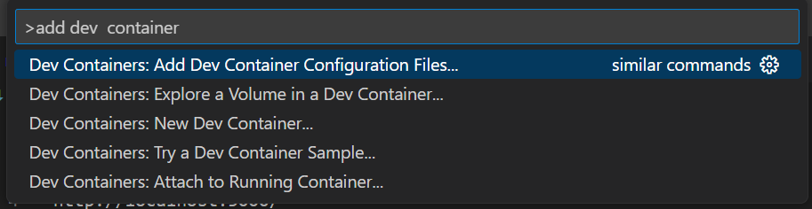

# react app 
 1. npx create-react-app .
 2. npm start 
http://localhost:3000/ 

## container part : 
1. open Command Palette : 

2. container configuration definition : choose Node.js + choose version (18 mine)
3. additional futures : choose AWS Cli / Git / GitHub Cli 
...
image / container with Docker Desktop 

