**Secret access key  : 739C2Z3fUNUl52L/RgSVcgpU28cL+jdQjFOm9eXy**

**Playlist :** 

[**https://www.youtube.com/playlist?list=PLG](https://www.youtube.com/playlist?list=PLG)**BwoKWNOSwPD2FW\_sueGPbWiqBJqKG8**

**Setup S3 Bucket with Polices for hosting React Site:**

1. **Connecting with IAM user**
1. **Create a new bucket named “myfirstreactapp00”** (no uppercase, unique globally)

Uncheck “block public access”

Leave other by default

1. **S3 bucket created successfully**
1. **Edit bucket proporties :**

Enable static website hosting :

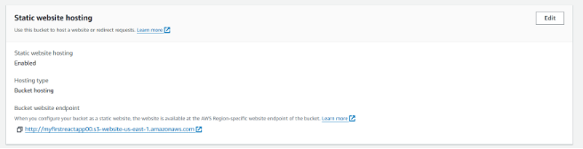

1. **Edit bucket permissions  :** 

Allow getObject: 

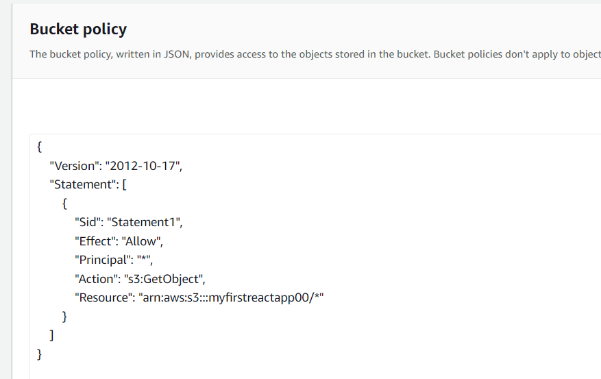

1. **Run the command “npm run build”** 
1. **Upload files in the “build” folder as objects for the s3 bucket** 
1. **Run the url  :** 

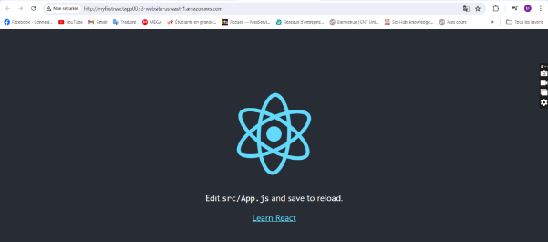

**Sync React files from local dev environment to S3 Bucket.**

1. **Add this line in the “package.json” file:** 

`    `"deploy":"aws s3 sync build/ s3://myfirstreactapp00 --profile=miniar"

(make sure to edit the credentials / config files in .aws or to run the command “aws configure” in order to precise the profile, secret key , secret access keu and region) 

1. **Modify something and Run theese 2 commands :** 

Npm run deploy

Npm num build 

1. **Run the aws url and the see the previous modification :**

**Add CloudFront Invalidation to react deploy script**

1. **Create a Ditribution in CloudFront**

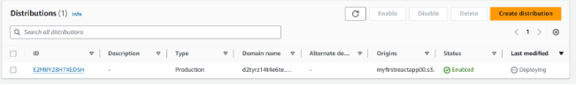

1. **Edit the “packages.json” file:** 

Add this line in “scripts” : 

` `*""deploy": "aws s3 sync build/ s3://myfirstreactapp00 --profile minyar && aws cloudfront create-invalidation --distribution-id E2MBY28H7XED5H --paths '/\*' --profile minyar"*

Run “npm run build” and “npm run deploy” 

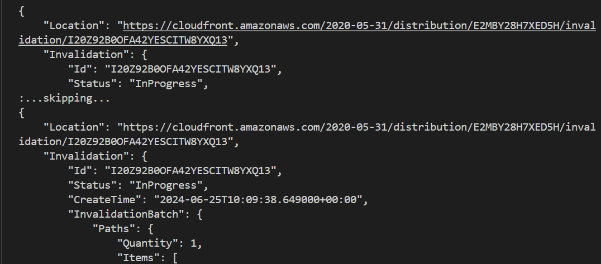

1. **See the results**

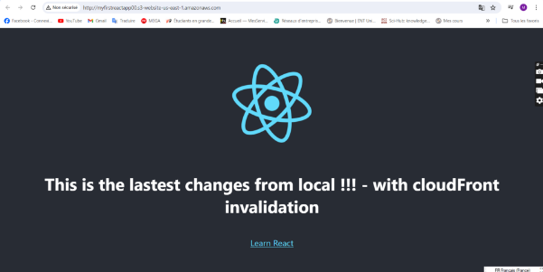

**Get Route 53 Domain**

Since this is not free, i won’t be able to do register a domain name, but here’s a video explaining the procedure:

<https://www.youtube.com/watch?v=t-NBg6zqplo&list=PLGBwoKWNOSwPD2FW_sueGPbWiqBJqKG8&index=6>

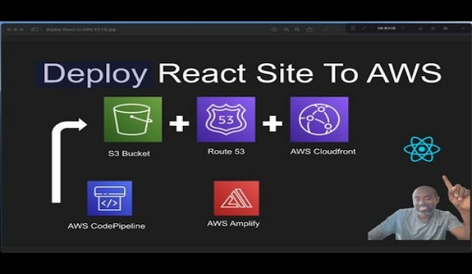

**Add react code to source control :**

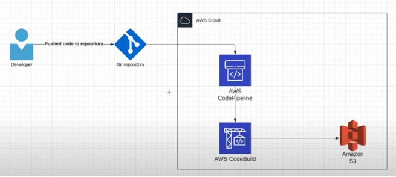

Push code to GitHub repository and then trigger aws pipeline, psuh changes to S3 bucket.

1. **Create github repository** 
1. **Push files in the previously created repo** 
1. ` `**Create AWS CodePipeline pipeline :** 

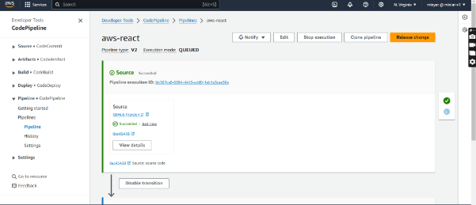

1. **Create “buildspec.yml” file:** 

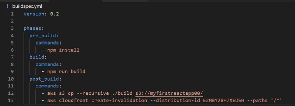 commit and push , result in the pipeline:

->Failed 

Reason: permisssion denied 

->Solution : add new policy : 

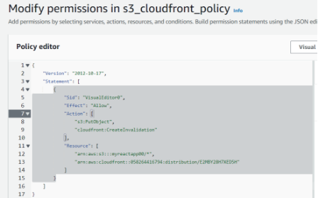

Retry pipeline: 

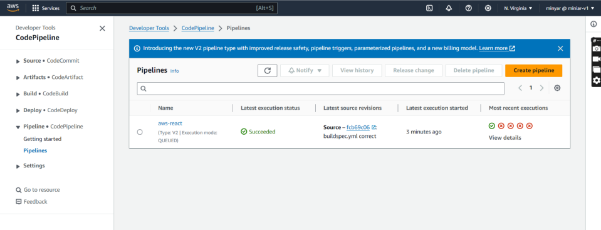

**Deploy React Site with AWS Amplify :**

**Backend :**

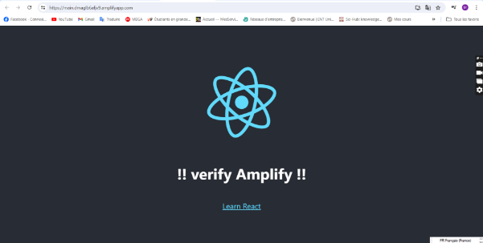

On vs code: 

Run theese commands: 

- Npm install –g @aws-amplify/cli
- Amplify configure 
  - Choose region 
  - Specify name of iam user
  - Access key id
  - Private access key id 
  - Profile name 
- Amplify init
  - Specify name
  - Name: myreactapp
  - Environment: dev
  - Default editor: Visual Studio Code
  - App type: javascript
  - Javascript framework: react
  - Source Directory Path: src
  - Distribution Directory Path: build
  - Build Command: npm run-script build
  - Start Command: npm run-script start
  - Choose profile name or access key 

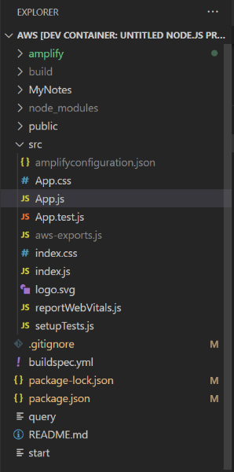

- Amplify add auth
  - Choose default / authentication method (email) 
- Amplify push

Change app.js code: 

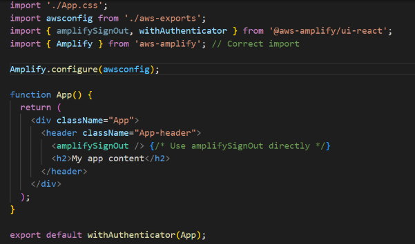 + command to install packages: 

- Npm install –-save aws–amplify @aws-amplify/ui-react

Test our app :

- Npm start :

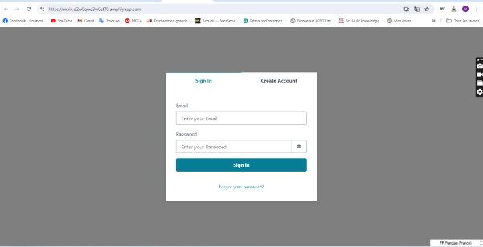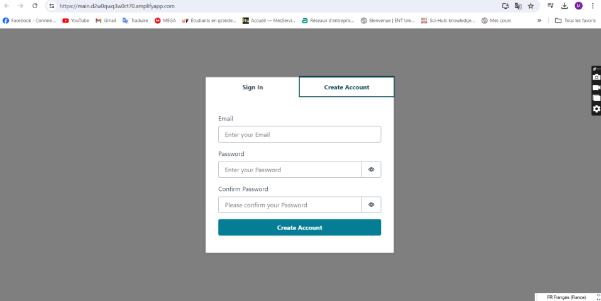 

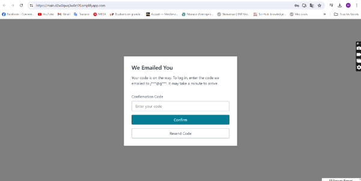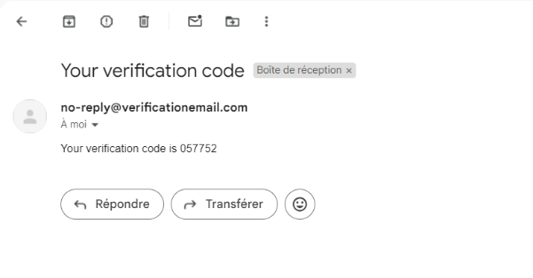

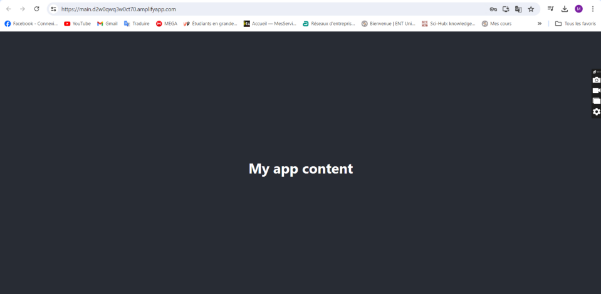

Aws- cognito : 

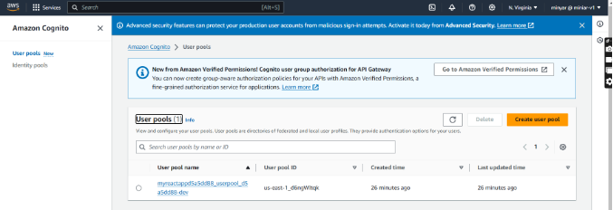

**Front-end :**

Add the front-end to amplify by Linking github repo to the amplify cloud in aws.amazon.com for the hosting environment : 

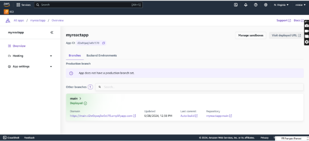 

Ps: make sure you create a new role (aws-amplify) and add that role .

